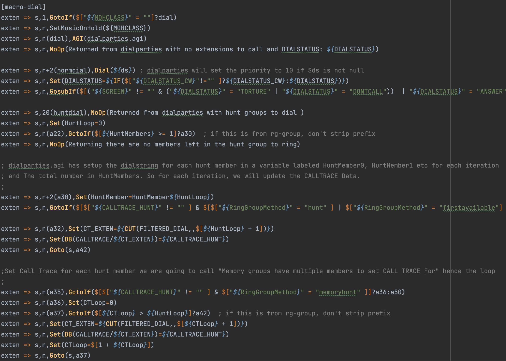

# asterisk.tmbundle
It's a simple TextMate syntax highlight bundle for asterisk dialplan script language. 

By default, PyCharm and other IntelliJ IDEs don't have dialplan support. 
It brings some challenges in the development process. I wrote TextMate bundle to have dialplan syntax highlighting in PyCharm.

Features:
1. syntax highlighting
2. code blocks support
3. the color scheme depends on your IDE's settings

### Example

---

### Installation

---

1. Open IntelliJ IDE
2. Open Preferences -> Editor -> TextMate Bundles
3. Press + (add) button
4. Choose asterisk.tmbundle directory
5. Be happy;)

By default, dialplan syntax highlighting works with *.dialplan files. 
If you want to work with files with another extension you should change the config file.
1. In asterisk.tmbundle directory open `Syntaxes/asterisk.tmLanguage`
2. Find `fileTypes` key in the first part of the file
3. Change `dialplan` in string section to your file extension

### Development

---
If you want to improve something follow the steps:
1. [Download](https://macromates.com/) TextMate text editor on your macOS
2. Double-click on downloaded asterisk.tmbundle bundle and install it
3. Open Bundles -> Edit bundles...
4. Choose your bundle -> Language Grammars -> asterisk
5. Do what you want;)

If you have some questions see documentation on https://macromates.com/textmate/manual/